

# B657 Assignment 1
### kumar13-pkolimi-vborra-a1

# Part 1:

Here we are implementing a pipeline, that receives an oriented musical staff notes, either diminished or enlarged. The task is that the pipeline should be able to receive the input, give proper orientation and rescale it suitable for users view. We started by taking an image input from the command line. The code works as follows: we first remove the noise by setting a certain threshold and binarizing the image, converting pixels to either white or black. Then, using the PIL library and nearest pixel interpolation, we applied the rotation feature to rotate the image. We set up a one-degree increment rotation ranging from 0 to 180 degrees. For each iteration, the image rotates, and during each iteration, we implemented a 2x2 kernel that runs across the image. The process keeps track of the row with the highest count of black pixels. After all rotations are completed, it returns the angle at which a particular row had the highest count of black pixels compared to all other orientations. Since the lines are horizontal, we assumed that at this angle, the black pixels would be more aligned in the rows. This approach worked for rotation.

The entire process is performed on an imaginary input image (stored in memory). To avoid miscalculations of black pixels, the corners are filled with white color. After the best angle is determined, we performed staff line detection on the rotated image, which is also imaginary. The process involves counting black pixels in each row individually using a 1x1 kernel across the image. The longest line with the maximum black pixels is selected as a staff line. Additionally, any row with at least 70 percent black pixels (this percentage is adjustable) is also considered a staff line. A minimum gap is assigned to avoid multiple detections of the same staff line.

Next, the pixel distance between the staff lines is calculated. Some lines may be detected, while others may not, leading to larger distances that are not ideal. Outliers are ignored, and the remaining distances are considered. A scaling factor is applied to these lines so that the distance between them is close to 10 pixels. The scaling factor is then recorded.

Some images might be flipped, meaning the clefs are on the right side instead of the left. To address this, we wrote code to calculate the number of black pixels in the first few columns of a certain width (which can be adjusted according to the image resolution). The counting starts from the columns where an initial black pixel is detected. This process is performed on both the output image and a 180-degree flipped version of the output image to determine which one has more black pixels on the left side. Based on this, the code returns either the normal or flipped image using the 180-degree flip feature.

Since we have calculated the angle, thresholding, and scaling factor on the imaginary image, these values are applied to the actual input image (which is not imaginary) to produce an output that is oriented and rescaled for the user to view. The final code only displays the final output. For reference, this is the process with breakpoints that occurs on the imaginary image, as shown in Figure 1.

  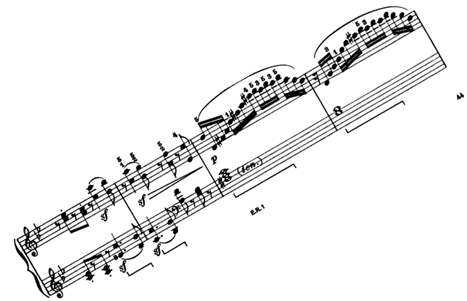
  
<em>Fig1a: Input image, orientation 30 degrees & 0.5 scaled</em>

  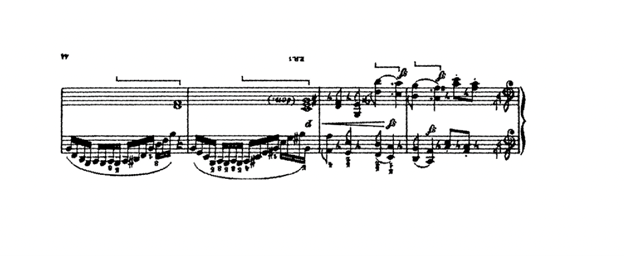
  
<em>Fig1b: The image is returned at the best angle after rotating it at 150 degrees.</em>

  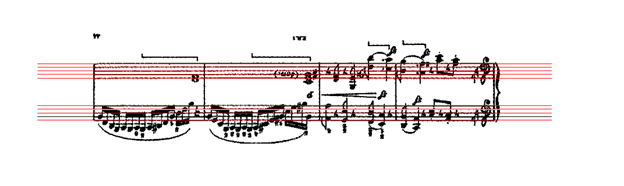
  
<em>Fig1c: The staff lines are detected based on the highest black pixel count row, and the rest based on that. A scaling factor is computed based on their distances.</em>

  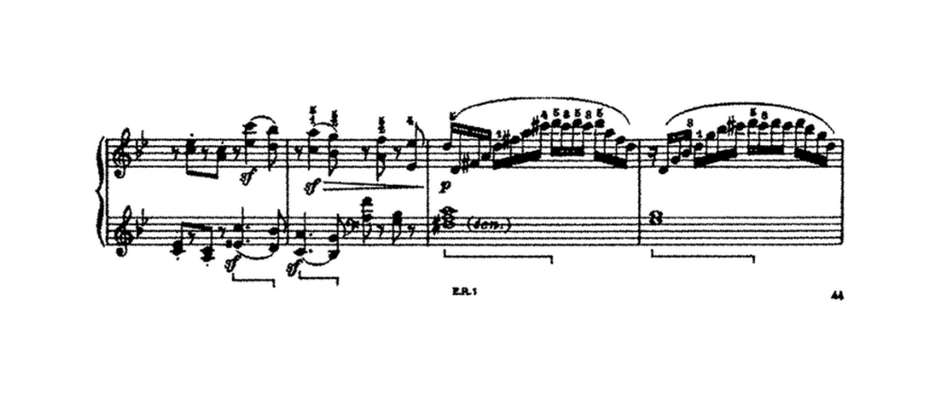
  
<em>Fig1d: After rescaling, the pixels mass is calculated on the original and flipped image, and the one with max black pixel mass is returned as the user's output. </em>

# Part 2:
This project aims to detect musical symbols (such as filled note heads, quarter rests, and eighth rests) from an image of sheet music. The system identifies staff lines, locates symbols, and assigns pitches to the note heads based on their position relative to the staff lines. As the instruction provided in the assignment 1 pdf for part 2, we followed the staff line detection, then identify likely note heads and then create the list of note names based on the position of the detected filled notes. The system aims to detect musical symbols, specifically filled note heads, quarter rests, and eighth rests, from an image of sheet music. It identifies the staff lines, and then uses template matching to locate symbols, assigning pitches to the note heads based on their position relative to the staff lines. There are multiple stages for the application to work. Below are the steps and processes. Below is an overview of the steps and processes involved. 

---

## Steps and Processes

- **1)**	Loads the input image and converts it to grayscale. Then invert the image and normalize pixel values to a range between 0 and 1. This preprocessing step is crucial for improving the performance of subsequent steps, especially when trying to detect the filled notes heads, quarter rests, and eighth rests.  The conversion to greyscale simplifies further processing by reducing the color information. A binary image is created by thresholding the grayscale image (with a cutoff value of 128) so that pixels are either black or white. This binary image helps in clear identifying the regions of interest. This is represented in the image below (Fig. 1).

  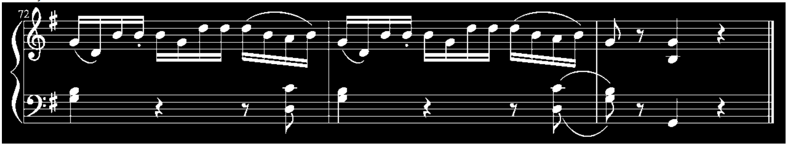
  
<em>Fig. 1- Binary image (thresholding at 128)</em>

- **2)**	Detects staff lines using morphological closing operations to connect line segments. Group and smooth the detected lines into treble and bass staves based on proximity. And then Estimates the line spacing to determine note pitches. Original image is inverted and normalized so that the background and foreground are better suited for template matching.

  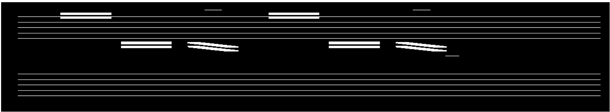
  
<em>Fig. 2 - Morphological operation (close_len=25)</em>

  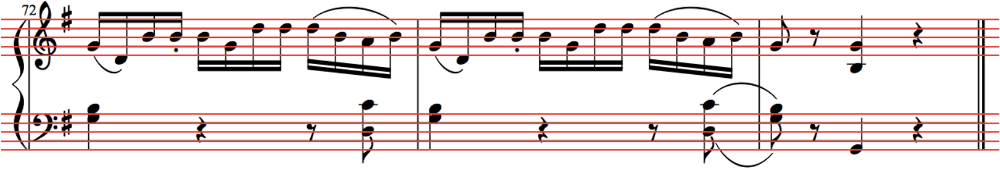
  
<em>Fig. 3 - Staff Line detection</em>

- **3)**	Now after staff line detection, use cross-correlation with pre-defined templates for filled note heads, quarter rests, and eighth rests. This method is useful to compare the template with the processed music sheet. Regions in the music image that have a high similarity score (above a defined threshold) are identified as note heads. Then employing Non-Maximum Suppression (NMS) to merge overlapping detections, ensuring each note head is detected only once. For the rests (Quarter and Eighth), separate template images for quarter rests and eighth rests are processed in the same manner.

  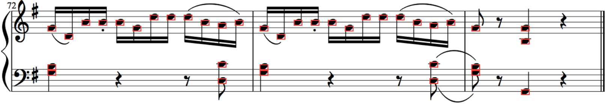
  
<em>Fig. 4 - Head notes detection</em>

- **4)**	Assigns musical pitches (A-G) to detected note heads based on their vertical position relative to the detected staff lines. It checks relative positions to the treble and bass staves and assigns the nearest pitch value.

- **5)**	Annotate the original image with bounding boxes around detected symbols and pitch labels for note heads. Then save the annotated image as detected.png and the text file as detected.txt containing all the required values like coordinates, dimensions, symbol type, pitch and the confidence score for each detected symbol.

- **i)**	Laplacian of Gaussian (LoG): works by first smoothing an image to remove noise (like making a picture less blurry) and then finding spots where the brightness changes a lot. These spots are called "blobs."
- **ii)** Difference of Gaussian (DoG): compares two smoothed versions of the same image to find differences between them. It's good at finding blobs of a specific size.
- **ii)** Determinant of Hessian (DoH): uses math to find blobs by looking at how the image curves or bends in different areas. It can find blobs of many shapes and sizes by looking for places where the bending is the strongest.

  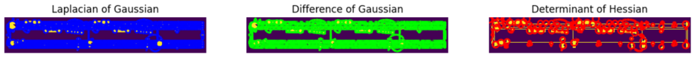
  
<em>Fig. 6 – LoG, DoG, and DoH</em>

  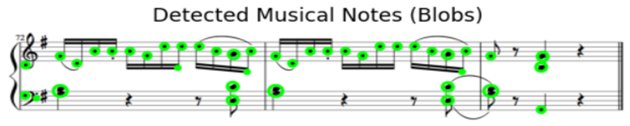
  
<em>Fig. 7 – Blob detections</em>

# Final process:
After exploring blob detection, we shifted our focus to detecting individual musical symbols, such as note heads and clefs by analyzing the grayscale variations on the music sheet (this is what we have discussed earlier in steps and processes). We extracted a small template image from the original music sheet and cropped it to match the size of the actual note heads. Additionally, we adjusted the templates height so that it aligned with the spacing between the staff lines. Using an  intersection over union (IoU)  method to compare the template with the music image yielded better results than the initial blob detection approach. 

To simplify matching, both the music image and the template were converted to black-and-white using pixel thresholding. We experimented with various filters and thresholds to capture as many matches as possible. Although the early results were only moderately successful, they worked well in most cases.

After trying several methods, we eventually implemented a cross-correlation technique, as suggested in the assignment documentation, to match note heads and music rests (both quarter and eighth rests) from the template with the original music image. This method improved detection precision by adjusting pixel intensities and brightness levels, producing a similarity map that highlighted potential note locations. However, further adjustments to the threshold values were needed. For each symbol template, we set a specific threshold to determine potential note locations, which resulted in the generation of bounding boxes. In some instances, these boxes overlapped. To resolve this, we implemented non-maximum suppression: if overlapping boxes exceeded a set threshold (for example, 0.1), they were merged into a single box representing the most likely position for the note. The parameters for overlap removal were fine-tuned through experimentation and proved effective in most cases.

Furthermore, the program also detects staff lines and estimates the spacing between them. This information is used to adjust the template image accurately and to assign the correct pitch to each detected note head. The end result is a fully processed and annotated image where the music sheet has been analyzed to highlight detected musical symbols. Each note head has been labeled with its corresponding pitch, and the rests have been marked with bounding boxes.

## Results
The final output is a fully processed and annotated image where the music sheet has been analyzed to highlight detected musical symbols. Each note head is labeled with its corresponding pitch, and rests are marked with bounding boxes.

  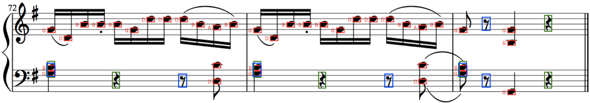
  
<em>Fig. 8 - Final Output Image</em>

## How to Run the Code
1. **Input**: Provide an image of sheet music.
2. **Output**: The program will generate:
   - An annotated image (`detected.png`).
   - A text file (`detected.txt`) containing details of detected symbols.
3. **Command to run**: `python omr.py music1.png`

---

# Part 3:

In this part of the assignment, the goal was to reassemble a scrambled image of sheet music. The image was divided into tiles of size nxn pixels, and these tiles were randomly shuffled. Our task was to unscramble them and reconstruct the original sheet music as clearly as possible.

### Steps and Methodology

#### Step 1: Load, Split, Binarize and Identify the Top-Left Tile (Cross-Correlation):
We began by splitting the scrambled image into nxn tiles. Because we needed to find the original top-left tile, we also binarized a template image that represents that tile, converting black pixels into 1s and white pixels into 0s. Next, we set out to identify the top-left tile using a template matching approach. A template image of the supposed top-left tile was provided. We tried matching it against all scrambled tiles by binarizing each and computing a score map via cross-correlation. The tile with the highest score was deemed the top-left tile, serving as our starting point for reassembly.

#### Step 2: Build the First Column, Reconstruct the Image Column by Column, Experiment with (Row by Row)
Beginning with the confirmed top-left tile, we tried comparing the bottom edge of each tile in sequence to the top edges of remaining tiles. The best match was placed beneath the previous one until the first column was complete. For column-based assembly, we computed a combined matching score for every new tile, looking at both its left and top edges relative to placed tiles. The tile with the lowest score was selected next, ensuring alignment both horizontally and vertically. We tried building the first row by comparing the right edge of each placed tile to the left edges of potential matches. Once the first row was finished, we continued for each subsequent row, ensuring edges aligned horizontally and vertically.

<table align="center">
  <tr>
  <td>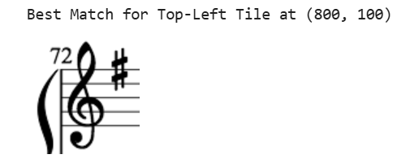 <em>Fig. 1 - Best match for top left</em></td>
  <td>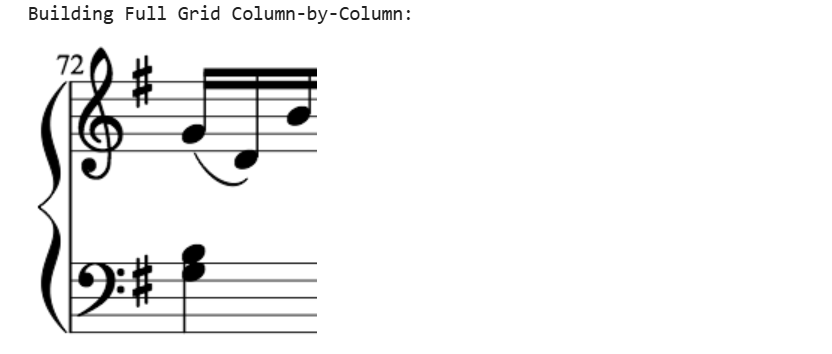 <em>Fig. 2 - Column by Column construction</em></td>
  <td>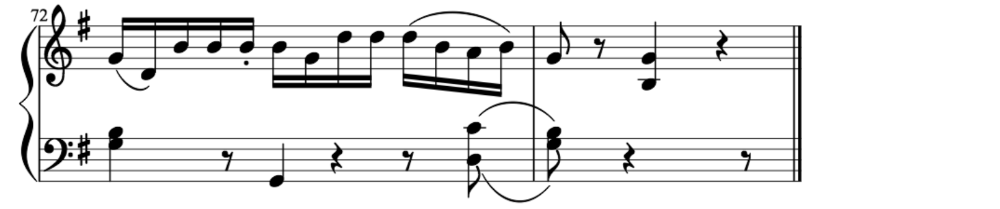 <em>Fig. 2 - Column by Column construction continued</em></td>
  </tr>
</table>

#### Step 3: Final Reconstruction
Finally, we created a new image at the original dimensions and pasted each tile into its correct position, resulting in the unscrambled sheet music.

  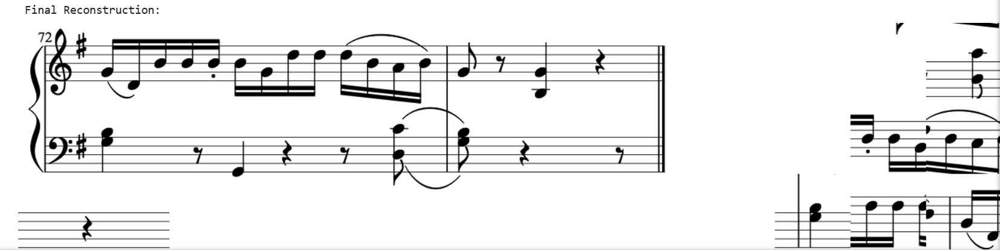
  
<em>Fig. 8 - Final Output Image</em>

In the first method, edge similarity is computed using the sum of squared differences (SSD). For each tile, the top, bottom, left, or right edge is extracted and compared to its neighbors. Multiple rows or columns of edge pixels can be considered. SSD is calculated by squaring and summing pixel-by-pixel differences, and then averaging these values. A lower SSD indicates a stronger tile match.

To reassemble the image, the input is divided into square tiles, placed into a grid for reconstruction. The first tile is positioned at the top-left corner. The algorithm proceeds row by row, selecting the next tile based on whichever adjacent edge-left or top-produces the lowest SSD. Once all tiles are placed, the original image is recreated.

Method 2 also splits the image into non-overlapping blocks but uses edge detection for tile matching. Each block is converted to grayscale, and the Sobel operator is applied horizontally and vertically to derive gradient magnitudes. The top, bottom, left, and right edges of each block are stored for comparison. Pairwise distances between these edges are then computed using cosine similarity. The algorithm greedily assembles the image by placing blocks in the best matching order, row-wise and column-wise, until all blocks are positioned.

Both methods support various tile sizes (e.g., 64, 100, 200). After the blocks are arranged into a full grid, a new image is generated by combining the tiles in their reconstructed order. Finally, the output is saved as a separate file.

<table align="center">
  <tr>
  <td>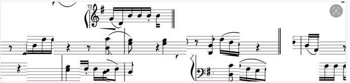 <em>Fig. 1 - With 3 edges and 100 tile size</em></td>
  <td>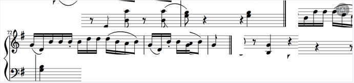 <em>Fig. 2 - Tile size 64</em></td>
  </tr>
</table>

<table align="center">
  <tr>
  <td>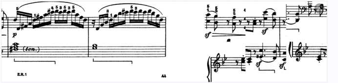 <em>Fig. 1 - Tile size 200</em></td>
  <td>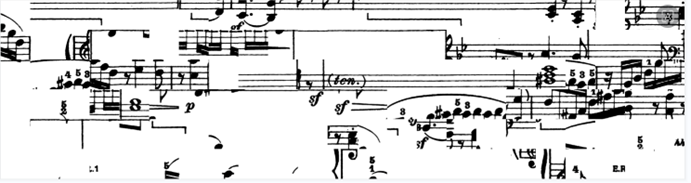 <em>Fig. 2 - Tile size 64</em></td>
  </tr>
</table>

#### Approach1: 
I initially relied on the Hough Transform for staff line detection, assuming it would effectively identify straight lines. First, I preprocessed the image to enhance contrast and remove noise, then converted it to grayscale to simplify the data. Next, I applied thresholding to better distinguish white and black pixels and reduce minor noise. An edge detection filter highlighted critical features of the sheet music, primarily focusing on prominent horizontal structures while suppressing irrelevant details.

The algorithm operated by mapping edge points from the Cartesian coordinate system into a parameterized Hough space, where each point contributed votes toward potential lines passing through it. Prominent lines emerged from areas with high voting counts. Each detected line was then converted back into Cartesian coordinates, allowing precise staff line locations to be overlaid on the original image. Finally, these lines were shown in red for visualization, and their coordinates were printed.

However, several issues arose. Images scaled to 2x or 1.5x typically worked well with the code, but when images were reduced, detecting staff lines became harder, causing the algorithm to identify bar lines instead. Despite adjusting parameters to favor stronger lines, it still failed on certain images.

#### Approach2: 
We begin by thresholding pixel values into binary (0 and 1) and dividing the image into tiles based on the specified size. For the left column, we identify candidate tiles that feature mostly white columns on their left edge and at least one black pixel. Tiles with both left-bottom white margins or left-top white margins are also included as candidates.

To compare tiles, we store only edge pixels in vectors and compare them pairwise. If fewer than three pixels differ between the bottom edge of one tile and the top edge of another, the match is considered strong. We then follow a greedy approach, placing the tile with the best match. If no suitable match is found, the algorithm backtracks and tries a different arrangement.

While this method can theoretically find a global optimum by checking all combinations, its complexity grows factorially (e.g., 4x15 tiles). We experimented with other optimization techniques, such as quadratic programming, simulated annealing, and discrete wavelet transforms, but the brute-force backtracking remains computationally expensive for larger tile sets. A knowledge-based or heuristic approach could reduce complexity, making the algorithm more feasible for bigger puzzles. Despite its limitations, this method can deliver accurate results on smaller grids, demonstrating its potential with proper optimization.

<table align="center">
  <tr>
  <td>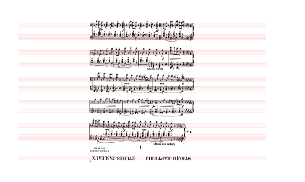 <em>Fig: Scrambled input in 3x7 grid</em></td>
  <td>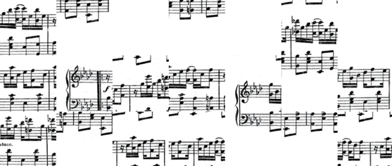 <em>Fig: It works by selecting left individual tiles that obey our conditions and start adding it them.</em></td>
  </tr>
</table>

#### ------------  End of our experimentation ----------------

#### Results and Discussion
The scrambled image was successfully reconstructed, though not perfectly. The top-left tile and first row were reasonably accurate, but some tiles in later rows were slightly misaligned.

#### Limitations
**i**: Perfect alignment is assumed; slight noise or edge distortions can cause mismatches.

**ii**: Similar edge patterns across multiple tiles can lead to incorrect placements.

#### Future Improvements
**i**: Use a more robust matching algorithm that considers the global structure of staff lines and symbols rather than relying solely on edges.

**ii**: Automate the detection of the top-left tile to avoid providing a template manually.

### Why this is a good approach: 

The methods we have used till now are after a lots of experimentation and reading papers, with the proper libraries used like scipy, opencv we can reduce the computation process, for rotations, hough transforms, use inbuilt kernels, and memorize the values in better resolution. We can run the filters more efficiently without running out of time. This method are  built from scratch and will have to work if there is no problem with computation, if modified the backtracking.All the combination need to be calculated for a robust and global optimum solution. But the factorial value increase the more we have the tiles, smaller the n number of tile like 2 x 10, 4 x 5 this code works, but for bigger tile numbers like 4x15 that is 60 tiles that is 8^60 x 60!  And the calculation goes so on, that the local machines wont support. It can be improved by not fully implementing backtracking DFS but any other knowledge based approached, which will allow it to memorize the compatibility.

## References:
1. 	https://liorsinai.github.io/coding/2020/06/26/scramble-puzzle.html
2.	https://www.researchgate.net/publication/261446574_Solving_Image_Puzzles_with_a_Simple_Quadratic_Programming_Formulation
3.	https://ieeexplore.ieee.org/document/8126004
4.	https://ieeexplore.ieee.org/document/6382740
